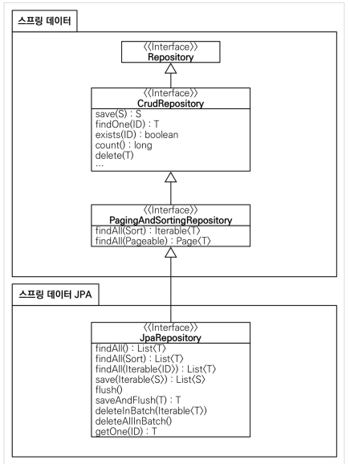

## JPA - 인터페이스의 일종
- 기존의 반복코드는 물론이고, 기본적인 SQL도 JPA가 직접 만들어서 실행해준다.
- JPA를 사용하면, SQL과 데이터 중심의 설계에서 객체 중심의 설계로 패러다임을 전환할 수 있다.
- JPA를 사용하면 개발 생산성을 크게 높일 수 있다.
- ORM: 객체와 데이터베이스 테이블을 매핑
- 어떻게? - 어노테이션

- 주의할 점: 항상 트랜잭션이 필요함

-> @commit 달아서 Test 할 때도 데이터베이스에 잘 들어가는지 확인가능

> 스프링 데이터 JPA
- 스프링 부트와 JPA만 사용해도 개발 생산성 대폭 증가
- 스프링 데이터 JPA는 JPA를 편리하게 사용하도록 도와주는 기술
- JPA를 학습한 후에 스프링 데이터 JPA를 학습해야함
- 이제 스프링 데이터 JPA는 필수

동작
- 스프링데이터 JPA SpringDataJpaMemberRepository를 스프링 빈으로 자동 등록해줌
