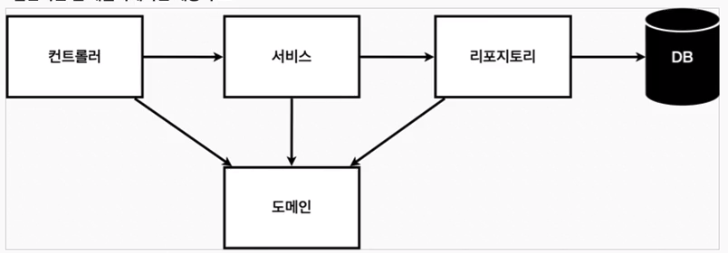

## ✅ 백엔드 개발

### 비즈니스 요구사항 정리
- 데이터: 회원ID, 이름
- 기능: 회원등록, 조회
- 아직 데이터 저장소가 선정되지 않음(가상의 시나리오)  

### 일반적인 웹 애플리케이션 계층 구조
- 컨트롤러 : 웹 MVC의 컨트롤러 역할
- 서비스 : 핵심 비즈니스 로직 구현
- 리포지토리 : 데이터베이스에 접근, 도메인 객체를 DB에 저장학 관리
- 도메인 : 비즈니스 도메인 객체 예) 회원, 주문, 쿠폰.. 데이터베이스에 저장하고 관리됨
  

### 클래스 의존관계
- 아직 데이터 저장소가 선정되지 않아서, 우선 인터페이스로 구현 클래스를 변경할 수 있도록 설계
- 데이터 저장소는 RDB, NoSQL등 다양한 저장소를 고민중인 상황
- 개발을 진행하기 위해서 초기 개발 단계에서는 구현체로 가벼운 메모리 기반의 데이터 저장소 사용

### 회원 레포지토리 테스트케이스 작성 -> Junit
- 코드를 코드로 검증하기
- 클래스 파일 이름은 관례 상 "테스트하려는 클래스 이름+Test"