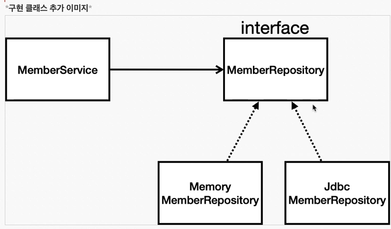
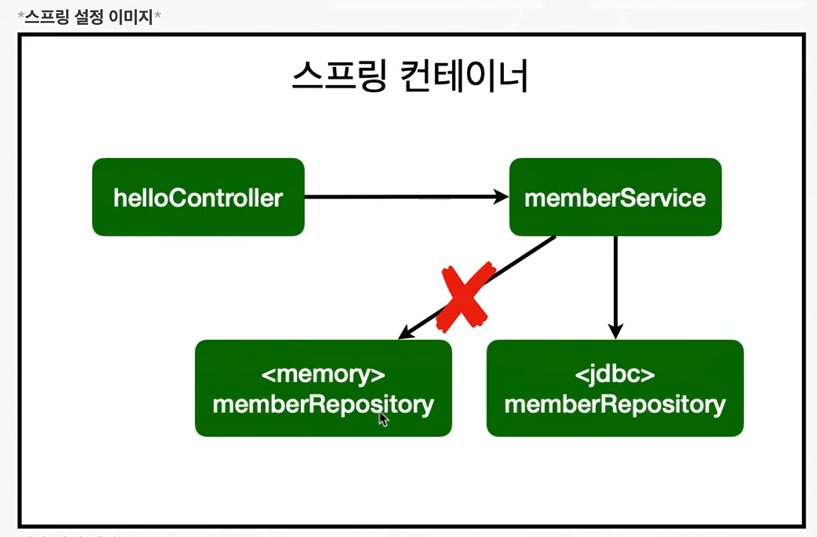

### H2 대이터베이스 설치
- 개발이나 테스트 용도로 가볍고 편리한  DB, 웹 화면 제공

- 데이터베이스와 연결하기 위해서 필요한 것이 JDBC
- 스프링이 jdbctemplate를 통해 쉽게 연결할 수 있도록
- JPA라는 기술 

### H2 사용
- 다운로드 : https://www.h2database.com/html/main.html
- 다운받아서 h2 폴더내의 bin 폴더로 이동
- cmd에 "h2.bat" 입력 (맥은 chmod 755 h2.sh 입력, ./h2.sh 입력)

### 순수 jdbc

### 구현 클래스

- 개방-폐쇄 원칙 (확장에는 열려있고, 변경에는 닫혀있다.)
- 스프링의 DI를 사용하면 기존 코드를 전혀 손대지 않고, 설정만으로 구현 클래스를 변경할 수 있다.
- 회원을 등록하고 DB에 결과가 잘 입력되는지 확인하자
- 데이터를  DB에 저장하므로 스프링 서버를 다시 실행해도 데이터가 안전하게 저장된다.

### 트랜잭션
- Test할 때 @Transactional 어노테이션을 달면 테스트를 실행할 때 트랜잭션을 먼저 실행하고
- DB에 데이터를 insert 쿼리로 넣은다음에 테스트가 끝나면 다시 **롤백**을 해줌
- DB에 데이터가 남지 않으므로 다음 테스트에 영향을 주지 않는다. 즉, 반복적인 테스트가 가능하게된다.
- @commit은 커밋 해버림

조언: 통합테스트보다 단위테스트를 잘 작성하는 것이 더 좋다!

### JdbcTemplates - 라이브러리
- 스프링 JdbcTemplate와 MyBatis 같은 라이브러리는 JDBC API에서 본 반복 코드를 대부분 제거해준다
- 하지만 SQL은 직접 작성해야한다.

## 정리
- jdbc에서 jdbctemplate로 바꾸는 실습을 해봄
- 반복적인 코드가 확 줄었음을 알 수 있었다.
- JPA를 사용하면 쿼리도 JPA가 자동으로 처리해줌