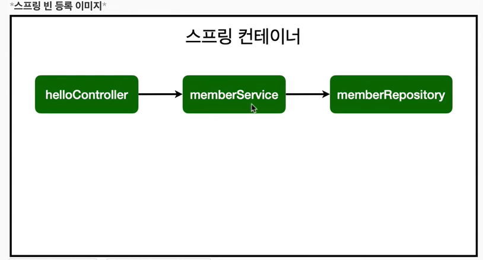

## ✅ 스프링 빈과 의존관계 - 1번째 방법

### 스프링 빈을 등록하는 2가지 방법
- **컴포넌트 스캔 방식 : 스프링이 올라올 때 컴포넌트 관련 어노테이션이 있으면 대상은 스프링이 모두 객체를 생성해서 컨테이너에 등록
  이 때, autowired는 연관관계를 가지게 해줌**
- 자바 코드로 직접 스프링 빈 등록 :

- 멤버컨트롤러가 멤버서비스를 통해서 회원가입/데이터 조회할 수 있어야함  
> 참고: 스프링은 스프링 컨테이너에 스프링 빈을 등록할 떄, 기본으로 싱글톤으로 등록
> 따라서 같은 스프링 빈이면 모두 같은 인스턴스이다.

### 멤버 컨트롤러 : @controller
- 스프링 컨테이너가 컨트롤러 어노테이션이 있으면 멤버 컨트롤러 객체를 생성해서 스프링에 넣어둠
- 위를 스프링이 관리  

### 스프링이 관리하게 되면
- **스프링 컨테이너 등록해서 컨테이너에서 받아서 쓸 수 있도록 바꾸어야함**
- new 해서 쓸 수 있지만 다양한 컨트롤러에서 멤버 service를 받아서 쓸 수 있지만,
- 여러 개의 인스턴스를 생성할 필요없이 하나 만들어놓고 공용하는게 좋다.  

### 스프링 컨테이너에 등록하기 : @Autowired, @Service, @Repository
- 생성자로 연결, @Autowired
- 스프링이 멤버컨트롤러와 멤버서비스를 연결시켜줌
 
- 오류나는 이유:  
   MemberService는 순수한 자바 클래스임 스프링이 알 수가 없음  

  

